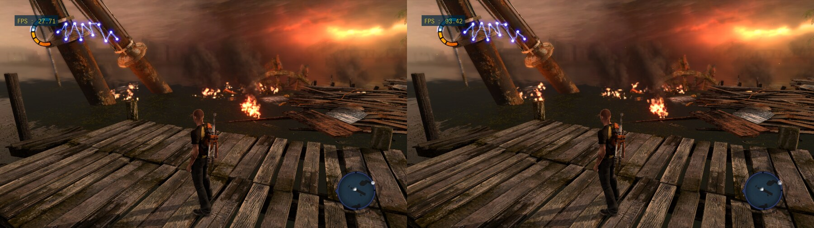
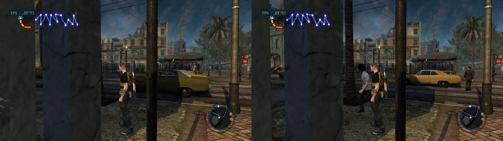
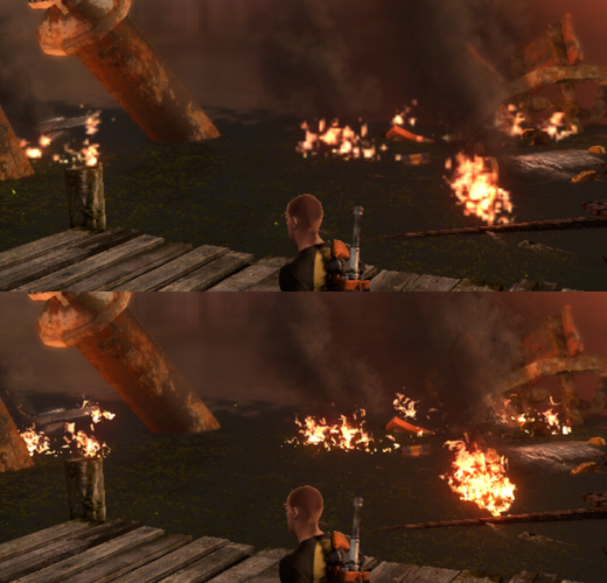

# RPCS3: inFamous 2 optimizations

A fork of [RPCS3](https://github.com/RPCS3/rpcs3) (upstream commit `0ca1c58`, version 0.0.43) with changes that make
inFamous 2 (BCES01143, v1.04) lighter to run on the Vulkan renderer. Upstream's own README is in
[README.upstream.md](README.upstream.md).

Everything was measured on one machine: a Ryzen 7 8845HS laptop with its integrated Radeon 780M (RADV), Linux, game
at 1280x720 with no quality settings lowered, on AC with the GPU left on its default governor.

| Scene | Stock, Strict Rendering on | Stock, Strict Rendering off | This build, 60 FPS cap | This build, uncapped |
|---|---|---|---|---|
| Burning dock (heavy lighting and effects) | 14.6 FPS | 27.6 FPS | 60.0 FPS | 95.7 FPS |
| City, slow street view (about 10,000 draws per frame) | 22.7 FPS | 31.8 FPS | 59.0 FPS | 60.5 FPS |
| City, savestate spawn view | 26.5 FPS | 33.1 FPS | 59.9 FPS | 69.9 FPS |
| Swamp pier (mission start) | 34.7 FPS | 34.3 FPS | 60.0 FPS | 108.0 FPS |

"Stock" is this same binary with every switch unset, which leaves RPCS3's own code paths; Strict Rendering Mode is
an RPCS3 setting, so the second column is the fair baseline. The game caps itself at 60 FPS. "Uncapped" turns the
frame limit off and sets the vblank rate to 120, which shows the headroom but is a benchmark setting, not a way to
play. Each figure is the mean of three 10-second samples from one boot of a savestate
(`infamous2/bench/compare.sh`); package power went from 31 W (stock, Strict off) to 38 W at the dock's 60 FPS cap.

Stock with Strict Rendering off on the left, this build uncapped on the right (FPS counter top left):





## Other games

- **inFamous: Festival of Blood** (NPEA00322) runs the same two SPU jobs as inFamous 2 at other guest addresses, so
  both GPU passes now cover it: 29.5 to 89.2 FPS uncapped in its opening catacombs, 60 FPS at the cap with 2.3 SPU
  cores. See [`festival/`](festival/README.md).
- **inFamous** (BCES00609) has neither job; it is a forward renderer limited by draw calls and by its SPU threads.
  The draw submission changes apply as they are (title screen city 54 to 76 FPS, first gameplay 47 to 66 uncapped),
  and one new change makes RPCS3's accurate SPU float mode, which this game needs, about a tenth faster where the
  SPUs are the limit. See [`infamous1/`](infamous1/README.md) for the whole list, change by change.

- **Ratchet & Clank Future: Tools of Destruction** (BCES00052) is another engine altogether: about 7,700 draws per
  frame into one pass, every one of them inside an occlusion query. Periodic command submission and the geometry
  cache carry it from 31 to 58 FPS in its opening view; fast repeat draws did nothing until the path learned the
  commands this game puts between draws, and front face and cull mode became dynamic state (65 to 67 FPS now,
  60 at the cap). A one-value game patch lifts the game's own 81 FPS ceiling. See [`ratchet/`](ratchet/README.md).

All three were tested for an evening each, in their first minutes (and one open-city district of inFamous).

These are software changes. The two host tuning steps that were also tried (a GPU clock floor and a power profile)
are kept apart in [`infamous2/hardware/`](infamous2/hardware/) and are off unless you ask for them.

This is experimental work on one game, tested in three areas of it, on one GPU driver. The changes that helped are on by
default (see below), and the tree still contains the diagnostics and the rejected experiments of the whole project.
It is not affiliated with or endorsed by the RPCS3 team.

## Using it

Build as upstream describes in [BUILDING.md](BUILDING.md), or download the AppImage from the
[releases page](https://github.com/ttmx/rpcs3-infamous2/releases) and pass it with `--rpcs3 path/to/rpcs3.AppImage`
(you still need this repository for the launcher and its configuration). Then:

```sh
infamous2/launch.py /path/to/inFamous2          # the disc folder that contains PS3_GAME
```

or set `INFAMOUS2_GAME` and `RPCS3_BIN` once and run `infamous2/launch.py`. The launcher finds `build/bin/rpcs3` of this
checkout by itself, uses your normal RPCS3 profile (firmware, saves, controller), a cache of its own
(`~/.cache/rpcs3-infamous2`), and the configuration in [`infamous2/play-config.yml`](infamous2/play-config.yml).
`infamous2/launch.py --help` lists the options; `--set NAME=VALUE` changes one switch, for example
`--set RPCS3_NATIVE_LIGHTING=0` to get the game's own lighting back.

Requirements and limits:
- The AppImage asks at every start whether to run an unofficial build. That is RPCS3's own warning for builds made
  outside its master branch; answer Yes.
- Linux, Vulkan. Nothing was tried on Windows, macOS, the OpenGL renderer, or Nvidia and Intel drivers.
- The exact game version above (European disc, BCES01143, patched to 1.04). The GPU lighting and occlusion passes
  only switch on for that title ID, so other regional releases run the game's own SPU jobs and get only the general
  renderer changes. The passes also rely on fixed guest addresses from that executable: the lighting job is checked
  by its bytes and falls back to the SPU code when they differ, the occlusion pass is not, so another patch level of
  BCES01143 is untested and may show wrong occlusion (`--set RPCS3_NATIVE_SSAO=0 --set RPCS3_NATIVE_LIGHTING=0`).
- Keeping static geometry on the GPU needs Linux 6.7 or newer (write tracking through `userfaultfd` and
  `PAGEMAP_SCAN`); on older kernels that one change does nothing.
- The streaming copies and the native SPU kernel are used only on CPUs with AVX-512; elsewhere the stock paths run.
- `play-config.yml` is a complete RPCS3 configuration (LLVM recompilers, 1280x720, 6 SPURS threads, Strict Rendering
  Mode off). Review it against your own settings.

## What was changed

Each line is one change, with its switch in parentheses. The ones listed here are on by default: the emulator sets
them itself at startup (`rpcs3/Emu/infamous2_defaults.h`) unless the variable is already in the environment, so
`RPCS3_VK_FAST_DRAWS=0 rpcs3` turns one off, and the launcher still sets them explicitly. These switches are not
specific to the game (only the two GPU passes and the material binding default check the title ID), so they are on for every title, and nothing but
inFamous 2 was tested with them. Figures are
from the machine above and are not additive: they were measured at different stages and scenes.

### The game's SPU rendering jobs, moved to the GPU

inFamous 2 renders a G-buffer, copies it to main memory, computes ambient occlusion and tiled deferred lighting on
the SPUs, and uploads the results as textures. Emulated, that round trip was most of the frame in heavy scenes.

- **Ambient occlusion on the GPU** (`RPCS3_NATIVE_SSAO=5`): the game's five-stage occlusion job is replaced by five
  full-screen passes written from a reverse-engineered reference; dock 44 to 56 FPS.
- **Deferred lighting on the GPU** (`RPCS3_NATIVE_LIGHTING`, bits 1, 4 and 8; the launcher sets 61): the tiled lighting job (point and spot
  lights, diffuse and specular) runs as compute passes and the SPU job skips its pixel work; about +15% at the dock.
- **No G-buffer readback** (`RPCS3_NATIVE_LIGHTING` bit 16): with both jobs on the GPU their image transfers are
  skipped, so the two 1280x720 images are no longer copied from the GPU to guest memory and back each frame; dock 73
  to 85 FPS uncapped.
- **No G-buffer blit** (`RPCS3_NATIVE_LIGHTING` bit 32): while both jobs are on the GPU, the game's two blits of the
  G-buffer to main memory are skipped too and the passes read the render targets, with one small pass that writes
  the depth target as the bytes the blit would have given. Matters with a resolution scale: dock uncapped 50.4 to
  53.9 FPS at 200%, 78.6 to 80.7 at 150%, no difference at 100%. A frame that turns out to need the SPU job after its
  blits were skipped is lit from old copies for that one frame; no such frame has been seen since the 256 light limit.
- **Half-resolution depth from the GPU pass**: the depth texture the game samples for particle effects, which the
  occlusion job used to produce, now comes from the GPU pass.
- **Up to 256 lights per frame**: eight mask words per tile; frames with more lights, or with light records the
  passes do not know, go back to the SPU job.
- **Resolution scale**: both passes work at the size of the game's render targets, so with RPCS3's Resolution Scale
  above 100% the lighting and the occlusion are computed at the scaled resolution rather than at 1280x720. Set
  `Resolution Scale` in `play-config.yml`; dock uncapped 94.9 FPS at 100%, 73.0 at 150% (1920x1080), 46.4 at 200%
  (2560x1440), where the integrated GPU is the limit. At 150% the game's own SPU jobs gave 45 FPS there.
- **Faster lighting passes**: five parallel compute passes with ordinary GPU arithmetic replace two that reproduced
  the SPU arithmetic bit for bit; about a third less GPU work and 2-4 W less at the 60 FPS cap, with a few pixels
  differing by a level or two.

### Draw submission

- **Periodic command submission** (`RPCS3_VK_PERIODIC_SUBMIT_US=1000`): recorded commands are submitted every
  millisecond instead of at the end of the frame, so the GPU works while the frame is still being recorded; dock 17.6
  to 27.7 FPS.
- **Submit during semaphore waits** (`RPCS3_VK_SEMAPHORE_PIPELINE_PREFETCH`): rendering that is already recorded is
  submitted while the game is still computing a semaphore value; +5.9%.
- **Static geometry kept on the GPU** (`RPCS3_VK_GEOMETRY_CACHE=1`): vertex and index data that does not change stays
  in persistent GPU buffers across frames, kept valid by kernel write tracking of the guest pages; city +11%.
- **Fast repeat draws** (`RPCS3_VK_FAST_DRAWS=6`): runs of draws that change only geometry and transform constants
  (the shadow-map passes most of all) are read straight from the command stream and drawn with the state already
  bound; city +10%.
- **Texture and polygon offset changes inside fast runs**: those commands no longer end a run when the shader variant
  stays the same; city 55.5 to 58.8 FPS at the cap.
- **Front face and cull mode as dynamic state** (`RPCS3_VK_DYNAMIC_FACE=1`, needs `VK_EXT_extended_dynamic_state`):
  both are set per draw instead of being part of the pipeline, so draws that differ only in them share a pipeline and
  stay inside fast runs. Ratchet & Clank flips the front face 425 times a frame: +6% there, nothing either way in the
  inFamous games. The first start of a game after this compiles the shader interpreter's pipelines again.
- **Descriptor set reuse** (`RPCS3_VK_DESCRIPTOR_REUSE=1`): a descriptor set already written with the same textures,
  samplers and buffers is bound again instead of allocating and writing a new one; city +2%.
- **Pipeline state reuse** (`RPCS3_VK_PIPELINE_REUSE=1`): pipeline properties that a full decode found unchanged are
  marked clean for the following draws; +0.4%, inside measurement noise.
- **Same-frame vertex cache** (`live.ctl`, third value): repeated vertex blocks within a frame are found through a
  128-bit fingerprint, and the cache switches itself off while few draws repeat; about +2% at the pier.
- **Inline command fetch** (`RPCS3_FIFO_INLINE_CACHE`): command stream reads that hit the validated cache skip the
  out-of-line fetch; pier 55.9 to 56.7 FPS.
- **Last image view** (`RPCS3_EXPERIMENT_LAST_IMAGE_VIEW`): each image remembers the view it handed out last, which
  saves a hash lookup when the same texture is sampled again; pier 55.9 to 57.0 FPS.

### Transfers between guest memory and the GPU

- **Partial upload after a blit** (`RPCS3_EXPERIMENT_BLIT_COMPLEMENT`): when a blit overwrites most of a surface, only
  the bands outside it are uploaded from guest memory (80% less data in the measured case); pier 55.9 to 59.1 FPS.
- **Streaming loads** (`live.ctl`, second value): uploads of 64 KiB and more from guest memory use non-temporal
  copies; pier about 53 to 55.9 FPS.
- **Streaming readback copy** (`RPCS3_VK_READBACK_STREAM_COPY`): multi-megabyte readbacks are written to guest memory
  with non-temporal stores; +1.6%.
- **Fused readback conversion** (`RPCS3_VK_READBACK_OOP`): the byte swap and the copy of the two G-buffer readbacks
  are done in one GPU step; +0.9%.
- **Serialized foreign readbacks** (`RPCS3_VK_READBACK_ADMISSION`): threads that fault on memory the GPU still owns
  queue for the readback one at a time instead of crowding the renderer's flush queue; about +5%.
- **Texture hits during a readback** (`RPCS3_VK_READBACK_SHARED_HITS`, `RPCS3_VK_READBACK_COMPRESSED_HITS`): read-only
  texture cache lookups, plain and compressed, can proceed while another thread holds the cache waiting for a readback.

### SPU

- **InstCombine in the SPU recompiler** (`RPCS3_EXPERIMENT_SPU_INSTCOMBINE`): LLVM's instruction-combining pass is
  added to the SPU pipeline, with its own object cache suffix.
- **Native SPU kernel** (`RPCS3_SPU_NATIVE_RWV`): one hot kernel of the game is replaced by a hand-written AVX-512
  version, matched by its exact bytes.
- **Accurate xfloat without doubles** (`RPCS3_SPU_XFLOAT_FAST`, acts only with `SPU XFloat Accuracy: Accurate`):
  add, subtract, multiply, multiply-add and the compares run in single precision, which gives the same bits because
  SPU threads already truncate and treat denormals as zero; operands and results outside the host float range take
  the regular double code. inFamous, burning street: 71.2 to 80.9 FPS; 2.8 billion results checked against the
  double code without a difference (`RPCS3_SPU_XFLOAT_FAST=2`). inFamous 2 runs Approximate and is not affected.
- **Savestates**: creating one retries the SPU thread lock 60 times instead of 15. Savestates still crash with
  InstCombine on; `--config infamous2/bench/cfg-nostrict-compat.yml --set RPCS3_EXPERIMENT_SPU_INSTCOMBINE=0 --set
  RPCS3_SPU_NATIVE_RWV=0` makes them work, and states made that way load under the normal settings.

### Picture

- **Full resolution particles** (setting `inFamous 2 Full Resolution Particles`, not an environment switch): the game
  draws fire, smoke, sparks and lightning into a 512x288 target and enlarges it over the 1280x720 picture, which
  looks blocky. With the setting on, that target and its depth buffer are made 2.5 times larger (and follow the
  Resolution Scale on top), so particles have the resolution of everything else. Off by default in the emulator, on
  in the launcher's `play-config.yml`. It can be switched while the game runs: PS button (or Shift+F10), Settings,
  Video, "inFamous 2: Full Resolution Particles"; with the RPCS3 window, the checkbox of the same name is in the GPU
  tab of the game's configuration. Cost at the dock (burning debris on screen): 97 to 93 FPS uncapped, and at the 60
  FPS cap 42.3 to 43.0 W with the GPU clock going from 1025 to 1110 MHz. BCES01143 and Vulkan only.

  

### Configuration

- **Strict Rendering Mode off**: on stock paths it nearly doubles the dock (14.6 to 27.6 FPS) and does nothing at
  the pier; with periodic submission on, the pier went from 49.4 to 52.8 FPS. `infamous2/launch.py --strict` turns it
  back on.

### Host tuning, kept separate

- **GPU clock floor** ([`infamous2/hardware/`](infamous2/hardware/)): the amdgpu governor left the 780M at a low clock
  in heavy scenes, and a 1600 MHz floor was the best FPS per watt before the GPU passes existed. With the current
  build the dock holds 60 FPS without it, so it is not part of the default launcher.
- **Performance power profile**: held through `powerprofilesctl` for the session, same folder.

Also in the tree but off: a cache of material image and sampler bindings (`RPCS3_VK_MATERIAL_BINDINGS`), which showed
no reliable gain, and the experiments the log records as rejected (ordered texture index, vertex copy offload,
zero-copy guest memory on amdgpu, source prefetching, and others).

## What else is here

- [`infamous2/docs/INVESTIGATION.md`](infamous2/docs/INVESTIGATION.md): the full log, with how each number was
  measured, what was checked for correctness, what was not, and what did not work.
- [`infamous2/bench/`](infamous2/bench/): the scripts that boot a savestate, switch changes on and off live and report
  FPS, power and clocks.
- [`infamous2/reference/`](infamous2/reference/): the offline tools behind the two GPU passes: an SPU disassembler and
  interpreter, NumPy references for both jobs, and the validators that compare the shaders against them.

No game data is included: no executable, savestates, saves, captured frames or disassembly of the game's code.

## Known gaps

- Tested at the swamp pier, the burning dock and one part of the city, in sessions of minutes, not hours.
- Resolution scales other than 100% were tried at the dock only (150% and 200%, standing still and firing lightning),
  and nothing computes a reference image above 1280x720: the check there is screenshots against the game's SPU jobs.
- Scenes with many lights were checked against the reference offline (64 lights); in the emulator only what those
  three areas contain.
- In frames with 20-60 lightning lights, 10-200 pixels of 921,600 differ visibly from the game's own SPU output, and
  the GPU result matches the offline SPU interpreter on those pixels. Unexplained.
- The geometry cache drew stale bytes for 3 of about 85 million reuses in one battery-powered session; it did not
  recur and the cause is not established.
- `--no-gui` sessions do not always exit on SIGTERM.

## License

GPL-2.0, as RPCS3 (see [LICENSE](LICENSE)).
