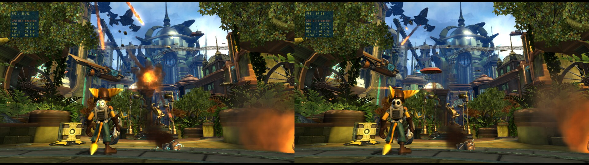

# Ratchet & Clank Future: Tools of Destruction (BCES00052 v1.00)

What of the inFamous work applies to another engine, and what this game needed on top. Tested with
`infamous1/bench/harness.py` (`INFAMOUS_TITLE=BCES00052`, `INFAMOUS_GAME` the game folder, `INFAMOUS_WORK=ratchet/bench`
for the configurations here) on one savestate, `metro`: the first seconds of gameplay. Configuration: RPCS3's
defaults (XFloat Approximate, Strict Rendering off, Write Color Buffers off) with Multithreaded RSX off.

All figures: Ryzen 7 8845HS / Radeon 780M on AC, power profile "balanced", 1280x720. The laptop was at 94 °C for
the later runs and the same arm lost about 5 FPS against the first hour (66 to 61 uncapped), so compare only figures
from the same row or the same boot.

Every fork switch off on the left, this build on the right (FPS counter top left, taken before the last two rounds):

## What the game does

- A forward renderer in the sense that matters here: no SPU job works on rendered frames, nothing is read back from
  the GPU, so none of the inFamous 2 GPU passes or transfer changes has anything to act on.
- The frame is draw calls: about 7,700 per frame in the opening view of Metropolis. The render thread is at one full
  core in every measurement and is the limit; SPU threads use 1.1 cores, the PPU 0.5, the GPU sits near 1200 MHz.
- Every draw is inside an occlusion query: the game asks for the pixel count of about 330 groups of draws per frame
  and uses the answers to decide which moving objects to draw.
- Outside the heavy view the game stops at 81 FPS by itself with the frame limit off.

## Result

Savestate `metro`: the first seconds of gameplay, looking down the avenue at the city under attack.

| | RPCS3 paths (every fork switch off) | fork before this work | fork now |
|---|---|---|---|
| uncapped, first hour | 31.2 FPS | 58.0 FPS | 64 to 66 FPS |
| uncapped, hot | 30.0 FPS | | 60.3 FPS |
| 60 FPS cap, hot | 30.1 FPS | | 58.4 to 59.5 FPS |

Turning the camera away from the avenue gives 72 to 81 FPS on the fork. Walking forward for 24 seconds: 60 to 76
FPS averages, with single dips to 31 to 50 while new shaders were compiled.

## Table

| inFamous 2 optimization | this game | note |
|---|---|---|
| Ambient occlusion and deferred lighting on the GPU, no G-buffer readback or blit, 256 lights, resolution scale in the passes | not applicable | The game has neither SPU job. |
| Periodic command submission | applies directly, on, the largest gain | Without it 36 FPS, with it 58 (everything else on). Intervals of 500 to 2000 microseconds are equal, 250 and 4000 are slower; the default 1000 stays. It did nothing measurable in the inFamous games. |
| Static geometry kept on the GPU | applies directly, on | 92% of vertex and 95% of index requests served from the cache; without it 46 FPS against 58. |
| Fast repeat draws | applied only after the changes below | As it was, no draw took the fast path (0 of 7,700): every run ended at a command the path did not know. Now 6,000 of 7,700 draws per frame; 59 to 66 FPS. |
| Texture and polygon offset changes inside fast runs | applies directly, on | 900 draws per frame have their textures set up again inside a run. |
| Descriptor set reuse, pipeline state reuse | apply directly, on | 850 sets reused against 890 written per frame; no measurable FPS difference with either off. |
| Material binding cache | applies, left off | 61% of 2,700 lookups per frame answered; check mode compared 1.2 million reuses without a mismatch. 65.0 to 66.2 FPS in one boot, nothing in another: not separable from the variation, so it is not a default for this game. |
| Wide fast-draw scope (`RPCS3_VK_FAST_DRAWS=2`: jumps, calls, vertex formats inside runs) | applies, left at the default 6 | The game chains its draws with 1,100 jumps and calls per frame. 66.4 against 64.5 FPS in one boot, 62.4 against 61.9 in another: not separable. |
| Same-frame vertex cache, inline command fetch, last image view, submit during semaphore waits | apply directly, on | Not measured one by one here. |
| Streaming loads, partial upload after a blit, readback changes | not applicable in practice | No readbacks or blits to act on. |
| InstCombine in the SPU recompiler, native SPU kernel | no effect expected | The SPU threads are not the limit; not measured. |
| Accurate xfloat without doubles | not used | The configuration is Approximate. |
| Full resolution particles | not applicable | That setting is for the inFamous 512x288 particle target. |
| Savestates | apply directly | Same recipe (`--cfg=savestate`, no `--defaults`); the state loads under the normal settings. |

## New work

All in the fast repeat draw path (`VKGSRender::fast_draw_batch`, `VKDraw.cpp`). A run now also passes over what
this game puts between two draws:

| change | fast draws per frame after it | note |
|---|---|---|
| Vertex base offset and base index (`NV4097_SET_VERTEX_DATA_BASE_OFFSET`, `_BASE_INDEX`) | 0 | Set before most draws (4,300 runs per frame ended here). Their handlers act only inside BEGIN/END; the draw reads the registers. |
| Vertex file invalidations (`NV4097_INVALIDATE_VERTEX_FILE` and its two neighbours) | 4,430 | What libgcm emits after a vertex array setup, three times before most draws. No handler, no state signal. 58.5 to 63 FPS. |
| Empty commands (zero words used as padding) | | 530 runs per frame ended at one. |
| A register written with the value it already holds | 6,040 | Front face, culling, depth and blend switches are set again between draws (1,200 runs per frame). Only for registers without a handler, plus the two face registers whose handler returns at once for an equal value. 63 to 66 FPS. |
| Fall back when the render pass key changed under the bound pipeline | | A fault the check mode found in this game and that the fork had before: after a texture change inside a run the texture lookup can regenerate the render pass key, and the run went on with the pipeline of the old key (268 of 542,000 checked draws). Now such a draw takes the complete path, and a run does not start in that state. |

Checks on the final build: mode 4 (after every texture change inside a run the complete program lookup must return
the bound program) 770,000 draws with camera turns, no mismatch; mode 3 (the complete path must leave all bound
state as it was) 1,700 qualifying draws per frame, no mismatch. inFamous 1, title city, same build: mode 4 over
960,000 draws without a mismatch, 70.9 FPS against 69.9 on the build without these changes.

What still ends runs, per frame: a real front face change 425, the occlusion report after each group of draws 326,
another fragment program 315, another primitive type 250. Making the first two part of a run would move about 750
draws to the fast path, by the measured rate under 2% of frame rate; not built.

## Configuration findings

- `Disable ZCull Occlusion Queries` must stay off. With it on the frame rate goes from 64 to 76 FPS because Ratchet,
  the crates and every other moving object are no longer drawn (`images/zcull-queries-disabled.jpg`).
- `Multithreaded RSX: true`: 67.3 against 63.9 FPS uncapped in one boot each, 59.5 against 59.0 at the cap. Left off.
- `Relaxed ZCULL Sync: false`, `Shader Mode: Async Shader Recompiler`, `Asynchronous Texture Streaming: false`:
  within 2 FPS of the default, one boot each.
- Performance power profile at the cap: 59.6 against 59.0 FPS for 37.5 W against 30 W. Not worth it.
- The RPCS3 wiki could not be read from here (it refuses automated requests). A forum thread reports fewer crashes
  with a vblank rate of 90 and mentions a freeze fix among the wiki's Canary patches; neither was tried, and no
  crash or freeze was seen in these sessions.

## Running it

`launch.py` in this folder starts the game on this build with your RPCS3 profile, `play-config.yml` (fullscreen,
frame limit Auto) and a cache of its own (`~/.cache/rpcs3-ratchet-tod`). The game's first start asks for a 95 to 100 second setup that
writes 0.4 GB to `dev_hdd1`.

## Not done

- Only the first minute of the first level was reached, and only its opening view was measured: no fights, no later
  planets, no space sections. The check modes say the new paths give the same results as the old ones there; they
  say nothing about scenes that were not run.
- Resolution scales other than 100% were not tried.

## Unlocked frame rate and higher resolution (2026-10-06, evening)

### The game's own ceiling: 81 FPS

With the frame limit off the game stopped at 81.4 FPS in every light view, whatever the vblank rate (60, 120 and
240 give the same figure), and followed `Clocks scale` exactly (162 FPS at 200, 41 at 50). It is in the game:

- `0x10731d00` is the game's time structure: `+4` the smallest time step (1/75 s), `+8` the largest (0.08 s),
  from `+0x14` the measured frame time and rate, and further on the same clamped to those two.
- The function at `0x692d40` holds every frame until 0.9 times the smallest step has passed since the last one
  (`sys_timer_usleep(500)` in a loop): 12 ms, 83 FPS, 81.4 with the sleep overshoot.
- So above 75 FPS the simulation step stays at 1/75 s while frames come faster: the game would run fast.
  Skipping only the wait (first attempt) gave 150 FPS with the step still pinned at 1/75 s, and 1,200 FPS in
  menus and videos, which the same wait paces.

Game patch "Unlock frame rate" (`patch-unlock-frame-rate.yml`, one value: the constant 1/75 at `0x8aa558`
becomes 1/300): the smallest step is 3.3 ms, the wait 3 ms, the ceiling about 300 FPS, and the step follows the
real frame time (read back from the structure: 0.00673 s at 148 FPS).

| view (uncapped, 100% scale) | without the patch | with it |
|---|---|---|
| opening view down the avenue | 64 FPS | 64.7 FPS |
| a quarter turn to the right | 81.4 FPS | 145.5 FPS |
| a little further | 81.4 FPS | 209.9 FPS |

Import the file in RPCS3's patch manager and enable it (or copy it to `patches/imported_patch.yml` of the RPCS3
configuration folder and enable it in `patch_config.yml`). It does nothing while the 60 FPS frame limit is on. It is not applied when a
savestate is booted, only on a normal start. Tested for a few minutes of standing and turning; nothing that
depends on the step (physics, fights, cutscenes in the engine) was looked at above 81 FPS.

Also learned on the way: the main thread waits for the occlusion reports of the frame by polling with
`sys_timer_usleep(30)` (`0x534fa0`, about 100 calls per frame). That is why periodic command submission is worth
so much in this game: the reports arrive when the GPU has finished the command buffer they are in.

### Higher resolution: the power limit, and shading per sample

| resolution scale | default | `RPCS3_VK_MSAA_PIXEL_SHADING=1` | `MSAA: Disabled` |
|---|---|---|---|
| 100% | 64.0 FPS | 62.3 FPS | 65.2 FPS |
| 200% | 51.9 FPS | 55.6 FPS | 58.9 FPS |
| 300% (two boots each, alternating) | 30.2, 31.8 FPS | 39.4, 38.0 FPS | 44.1, 43.5 FPS |

Opening view, uncapped. The 100% and 200% rows are one boot per cell, taken minutes apart, so differences of 2 FPS
there mean nothing.

- The GPU pass profiler (`RPCS3_VK_GPU_PASS_PROFILE=1`) puts all of it in one place: the 960x704 main pass with
  2x anti-aliasing takes 31.3 of 36.1 ms of GPU time per frame at 300%; the game's own resolve and post passes are
  under 4 ms together.
- CPU and GPU share the 30 W package limit of the "balanced" profile. At 300% the GPU runs at 2.1 GHz, 96 to 99%
  busy, and the render thread, still at a full core, at half the clock: 7.4 billion cycles in 4 s against 15.3
  billion at 100%, for the same instructions per frame. Both are at their limit at once, so less work on either
  side raises the frame rate at high resolution.
- RPCS3 runs the fragment shader once per sample when a target is multisampled (`set_multisample_shading_rate(1.f)`
  in `VKGSRender.cpp`, with a comment that interior edges otherwise resolve no samples on several GPUs).
  `RPCS3_VK_MSAA_PIXEL_SHADING=1` (new, off by default) leaves that out: one run per pixel, as the console does it.
  +25% at 300%. No holes or edge artifacts in the opening view at 100% or 300% (close-ups compared by eye), but
  that is one view on one GPU.
- `MSAA: Disabled` is cheaper still (+41% at 300%): half the shader runs and no multisampled buffers. At 100% the
  edges are visibly rougher; at 200% and 300% the difference is hard to see.
- Tried without effect at 300%: longer waits for the SPU thread that checks reservations (live control 5 at 200
  and 4000): 30.3, 30.5, 30.2 FPS. Two RawSPU threads sit in that wait for a third of a core each, but it is
  already a low-power wait.

Where the render thread's time goes now (call graph, opening view): texture lookup 15%, binding the program and
its descriptor sets 11%, vertex and index upload 12%, transform constants 5%, program lookup 5%, reading the
command stream 6.5%, periodic submits 2.6%. Three small textures are uploaded again every frame (32x32, 256x256,
16x16), which is what empties the material binding cache six times a frame and keeps it at 61% hits; a cache that
expires entries one by one is the next thing to build on the CPU side, worth about 5% by these shares.

### Running it unlocked

`launch.py --unlocked` uses `play-config-unlocked.yml` (frame limit off); `--scale 200` sets the resolution scale;
`--set RPCS3_VK_MSAA_PIXEL_SHADING=1` shades per pixel. In light views this runs at 150 to 200 FPS and keeps
the package at its 30 W limit the whole time, which the capped configuration does not.

## More of the render thread (2026-10-06, night)

Opening view, uncapped, 100% scale: 64 FPS before this round, 67 after (67.7 and 66.7 in two boots); at the 60 FPS
cap 59.9 with the render thread at 0.88 of a core, where it was at 0.97.

| change | state | note |
|---|---|---|
| Front face and cull mode as dynamic state (`RPCS3_VK_DYNAMIC_FACE`, on by default, needs `VK_EXT_extended_dynamic_state`) | done | The game flips the front face 425 times a frame (mirrored objects), and each flip was another pipeline and a draw on the complete path. Now both are set per draw (`set_dynamic_face_state`), left out of the pipeline key, and their changes stay inside fast runs. 61.6 to 65.3 and 63.5 to 67.5 FPS in alternating boots. inFamous 1 title city 76.5 against 76.7, Festival of Blood hall 90.1 against 89.7. The first start of every game after this compiles the shader interpreter's pipelines again (a few minutes). |
| Occlusion report commands inside fast runs | done | `NV4097_GET_REPORT` and `NV4097_CLEAR_REPORT_VALUE` go through their handlers and the next host query is started before the draw (`load_occlusion_task`, taken out of `emit_geometry`). 655 report commands a frame now pass inside runs. 68.1 against 67.6 FPS over three alternations in one boot: small. |
| Wide fast-draw scope as this game's default | done | With the two changes above the jumps and calls are what is left ending runs (570 a frame): 69.5 against 68.1 FPS over three alternations. For BCES00052 the default scope 6 now means 2. |
| Per-entry expiry of the material binding cache | measured, not built | The estimate in the section above was wrong. With a cache that never expires and also holds uncompressed textures (experiment switches, since removed) the opening view gains 2% over no cache, 0.9% over the cache as it is. |
| Longer waits for the SPU reservation checking thread | no effect | See above. |

Checks on this build: mode 4, 1.03 million draws with camera turns, no mismatch; mode 3 no mismatch; inFamous 1
mode 4 over 399,000 draws in the burning street, no mismatch.

Fast draws are now 6,170 of 7,600 per frame. What still ends runs: another fragment program 353, another
vertex program 160, another primitive type 250.

Measured on the way, for whoever continues: the render thread is busy 98% of the time in the opening view
(`RPCS3_FIFO_IDLE_TRACE=1`, `bench/idle.py`), so its full core is work, not waiting. A fast draw costs about 1.0
microsecond, a draw on the complete path about 4.4 (call graph: 40% of the thread for 6,000 fast draws, 46% for
1,600 complete ones).
